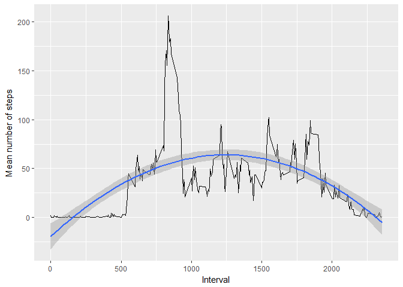

# Reproducible Research: Peer Assessment 1


## Loading and preprocessing the data

1. Load the data (i.e. read.csv())


```r
unzip("activity.zip")
raw <- read.table("activity.csv", sep = ",", header = TRUE, na.strings = "NA")
```

2. Process/transform the data (if necessary) into a format suitable for your analysis


```r
library(data.table)
data <- raw
data$date <- as.Date(data$date, format = "%Y-%m-%d")
data <- data[complete.cases(data),]
data <- data.table(data)
summary(data)
```

```
##      steps             date               interval     
##  Min.   :  0.00   Min.   :2012-10-02   Min.   :   0.0  
##  1st Qu.:  0.00   1st Qu.:2012-10-16   1st Qu.: 588.8  
##  Median :  0.00   Median :2012-10-29   Median :1177.5  
##  Mean   : 37.38   Mean   :2012-10-30   Mean   :1177.5  
##  3rd Qu.: 12.00   3rd Qu.:2012-11-16   3rd Qu.:1766.2  
##  Max.   :806.00   Max.   :2012-11-29   Max.   :2355.0
```

## What is mean total number of steps taken per day?

1. Calculate the total number of steps taken per day

```r
totalStepsPerDay <- data[,sum(steps),by=date]
```

2. Make a histogram of the total number of steps taken each day

```r
library(ggplot2)
ggplot(totalStepsPerDay, aes(x = V1)) +
  geom_histogram(stat="bin", binwidth=4000) +
  xlab("Total steps for each day")
```

 

3. Calculate and report the mean and median of the total number of steps taken per day

```r
mean(totalStepsPerDay$V1)
```

```
## [1] 10766.19
```

```r
median(totalStepsPerDay$V1)
```

```
## [1] 10765
```


## What is the average daily activity pattern?

1. Make a time series plot (i.e. type = "l") of the 5-minute interval (x-axis) and the average number of steps taken, averaged across all days (y-axis)

```r
meanStepsPerInterval <- data[,mean(steps),by=interval]

ggplot(meanStepsPerInterval, aes(x = interval, y = V1)) +
  geom_line() +
  xlab("Interval") +
  ylab("Mean number of steps for each day")
```

 

2. Which 5-minute interval, on average across all the days in the dataset, contains the maximum number of steps?

```r
meanStepsPerInterval[which.max(meanStepsPerInterval$V1)]
```

```
##    interval       V1
## 1:      835 206.1698
```

## Imputing missing values

1. Calculate and report the total number of missing values in the dataset (i.e. the total number of rows with NAs)


```r
sum(is.na(raw))
```

```
## [1] 2304
```

2. Devise a strategy for filling in all of the missing values in the dataset. The strategy does not need to be sophisticated. For example, you could use the mean/median for that day, or the mean for that 5-minute interval, etc.


```r
dataWithNAs <- raw
dataWithNAs$date <- as.Date(dataWithNAs$date, format = "%Y-%m-%d")
dataWithNAs <- data.table(dataWithNAs)

meanStepsPerInterval <- data.table(meanStepsPerInterval)

# For every row with "NA", apply the Avg Steps for the "interval" in that row.
# The Avg Steps is a double number, so its converted to integer.
naIndex = (1:nrow(raw))[is.na(raw)]
dataWithNAs[naIndex,1] <- as.integer(
  dataWithNAs[naIndex,
              meanStepsPerInterval[interval == interval]]$V1
  )
```


3. Create a new dataset that is equal to the original dataset but with the missing data filled in.

```r
summary(dataWithNAs)
```

```
##      steps             date               interval     
##  Min.   :  0.00   Min.   :2012-10-01   Min.   :   0.0  
##  1st Qu.:  0.00   1st Qu.:2012-10-16   1st Qu.: 588.8  
##  Median :  0.00   Median :2012-10-31   Median :1177.5  
##  Mean   : 37.33   Mean   :2012-10-31   Mean   :1177.5  
##  3rd Qu.: 27.00   3rd Qu.:2012-11-15   3rd Qu.:1766.2  
##  Max.   :806.00   Max.   :2012-11-30   Max.   :2355.0
```

4. Make a histogram of the total number of steps taken each day and Calculate and report the mean and median total number of steps taken per day.


```r
totalStepsPerDay <- dataWithNAs[,sum(steps),by=date]

ggplot(totalStepsPerDay, aes(x = V1)) +
  geom_histogram(stat="bin", binwidth=4000) +
  xlab("Total steps for each day")
```

 

```r
mean(totalStepsPerDay$V1)
```

```
## [1] 10749.77
```

```r
median(totalStepsPerDay$V1)
```

```
## [1] 10641
```

* Q: Do these values differ from the estimates from the first part of the assignment?
     * A: They do differ, but not by much.
* Q: What is the impact of imputing missing data on the estimates of the total daily number of steps?
     * A: The data seems to be slightly more concentraded near the mean.

## Are there differences in activity patterns between weekdays and weekends?

1. Create a new factor variable in the dataset with two levels – “weekday” and “weekend” indicating whether a given date is a weekday or weekend day.


```r
data$weekend <- lapply(weekdays(data$date), function(x) x == "Sunday" || x == "Saturday")
data$weekend <- factor(data$weekend == TRUE)
```

   1. Number os weekends and weekdays


```r
summary(data$weekend)
```

```
## FALSE  TRUE 
## 11232  4032
```

2. Make a panel plot containing a time series plot (i.e. type = "l") of the 5-minute interval (x-axis) and the average number of steps taken, averaged across all weekday days or weekend days (y-axis). See the README file in the GitHub repository to see an example of what this plot should look like using simulated data.


```r
weekendIndex <- (1:nrow(data))[data$weekend == TRUE]
weekdayIndex <- (1:nrow(data))[data$weekend == FALSE]
meanStepsWeekend <- data[weekendIndex,mean(steps),by=interval]
meanStepsWeekday <- data[weekdayIndex,mean(steps),by=interval]

meanStepsWeekend$weekend <- TRUE
meanStepsWeekday$weekend <- FALSE

meanSteps <- rbind(meanStepsWeekday, meanStepsWeekend)

ggplot(meanSteps, aes(x = interval, y = V1, col = weekend)) +
  geom_line() +
  xlab("interval") +
  ylab("Mean steps")
```

 
